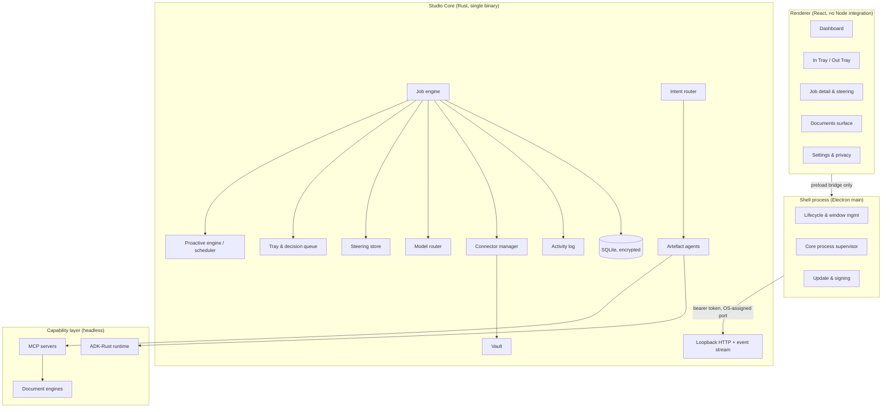
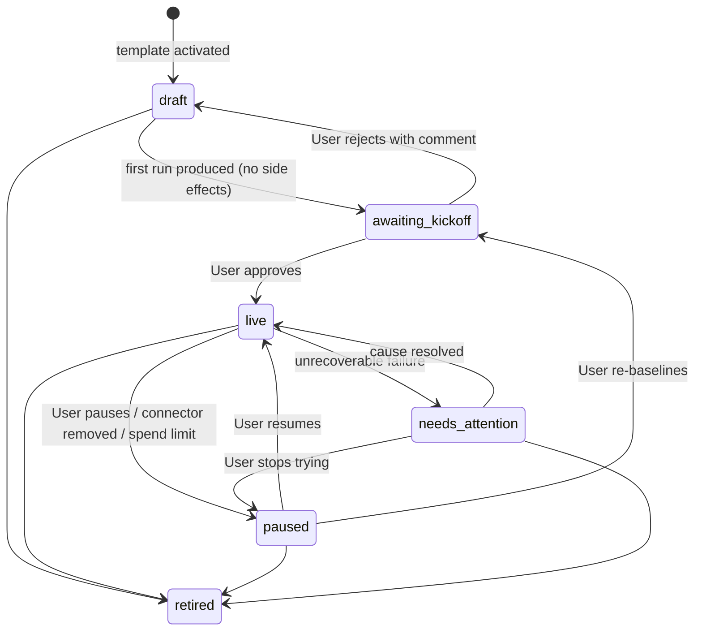
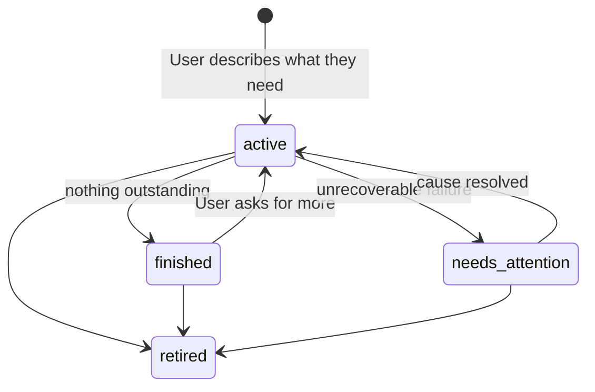
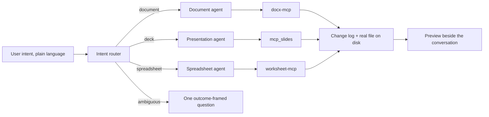
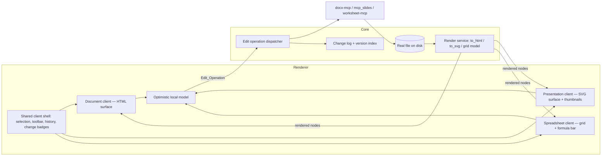
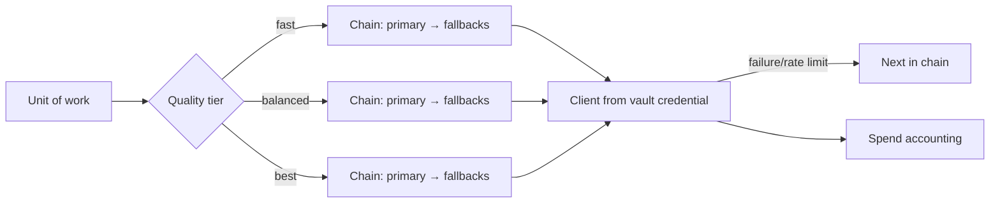

# Design Document: Zavora Work Studio

## Overview

Zavora Work Studio is a desktop application composed of two halves separated by a hard boundary:

- **The product surface** — everything the User sees and every concept they hold. Built from scratch for this product. Owns the Job abstraction, the trays, the Documents surface, and the vocabulary discipline.
- **The Capability_Layer** — proven, headless, reused verbatim. Document engines, MCP servers, and ADK-Rust crates. Contributes zero interface and zero User-facing concepts.

The prior attempt (`adk-desktop`) inverted this: its capability depth was excellent and its surface was a development environment. Its measurable outcome was a 51 KB MCP configuration panel and none of the ten target end-user jobs. This design keeps that engine and discards that cockpit.

The organising idea of the product surface is the **Job**. A Job is the only container of work the User ever manipulates. Everything technical — which agent ran, which model tier served it, which servers were called, how many attempts were made, what was checkpointed — hangs off a Job invisibly. If a technical concept has no home on a Job, it has no home in the product.

## Design Principles

These are binding, and several are enforced mechanically.

1. **The Job is the only noun.** New capability arrives as a new Job_Template or a new Connector, never as a new top-level concept.
2. **Vocabulary is enforced at build time.** A prohibited-term lint over the string catalogue fails the build (Requirement 1.2). This is the cheapest available defence against surface drift, and it is the specific defence the prior attempt lacked.
3. **Trust is bought once and maintained cheaply.** One Kickoff_Review per Job, then steering rather than gating. Approval fatigue is the failure mode that kills proactive products.
4. **Autonomy requires reversibility.** Every proactive action is either reversible, previewable, or explicitly marked as neither.
5. **The User's data is theirs in their formats.** Artefacts are ordinary files in a visible folder. Version history lives beside them, never inside them.
6. **Silence is a feature.** Recovered failures, failovers, retries and internal routing are recorded, not reported.
7. **Progressive disclosure has exactly two levels.** Primary surfaces, and one diagnostics view in Settings. There is no third level and no "advanced mode".

### Vocabulary translation table

The left column is prohibited in User-visible strings; the right column is the sanctioned expression.

| Internal concept | User-visible expression |
|---|---|
| MCP server / toolset | "Gmail", "Google Calendar", "X" (the account) |
| Model, provider, token, prompt | nothing; or "Quality: balanced" in Settings |
| Tool confirmation / approval policy | "Ask me before it sends anything" |
| Session, run, invocation | "Yesterday's newsletter", "This morning's check" |
| Agent, sub-agent, orchestration graph | nothing |
| Artefact, artefact store | "Files", "Version history" |
| Checkpoint, interrupt, resume | "Paused", "Waiting for you" |
| Skill | nothing; or "Knows how to build decks" |
| Cron expression | "Every weekday at 7:00 am" |
| Trace, span, telemetry | confined to diagnostics view |

## Reuse Boundary

### Layer 1 — reused verbatim, headless, no interface

| Component | Path | Role in Work Studio | Evidence of readiness |
|---|---|---|---|
| `zavora-xlsx` | `projects/zavora-xlsx` | Spreadsheet engine | 588 tests, 75 examples, formula engine with `recalculate()`, edit-mode round-trip tests |
| `zavora-slide` | `projects/zavora-slide` | Presentation engine | 736 tests / 22 files; `tests/corpus.rs` proves unedited open→save is byte-identical and edits are surgical |
| `zavora-docx` | `projects/zavora-docx` | Document engine + layout/render | 340 tests; layout engine renders PDF/PNG/HTML/Markdown from one document object |
| `worksheet-mcp` | `projects/mcp-servers/worksheet-mcp` | Spreadsheet tool surface | 95 tools; charts, pivots, conditional formats |
| `mcp_slides` | `projects/mcp-servers/mcp_slides` | Presentation tool surface | 72 tools incl. `render_slide`, `lint_design`, WCAG contrast QA |
| `docx-mcp` | `projects/mcp-servers/docx-mcp` | Document tool surface | 89 tools, 21 templates |
| `mcp-email` | `projects/mcp-servers/mcp-email` | Email Connector backend | Real: Gmail API, MS Graph, SendGrid, SMTP/IMAP/SES, OAuth |
| `mcp-calendar` | `projects/mcp-servers/mcp-calendar` | Calendar Connector backend | Real: Google Calendar v3, MS Graph |
| `mcp-news` | `projects/mcp-servers/mcp-news` | Newsletter and monitor ingestion | Real and keyless: BBC RSS, GDELT, arXiv |
| `mcp-credentials-vault` | `projects/mcp-servers/mcp-credentials-vault` | Vault backend | Local file-backed vault is the default feature |
| `mcp-pdf` | `projects/mcp-servers/mcp-pdf` | PDF export and assembly | 58 tools, fully offline, no keys |
| `mcp-browser` | `projects/mcp-servers/mcp-browser` | Website monitor, page reading | Real headless Chrome |
| ADK-Rust runtime | `projects/adk-rust` | Agent execution | `adk-runner` (in-process, no server required), `adk-agent` (LlmAgent, Sequential/Parallel/Loop), `adk-session` (SQLite), `adk-artifact` (file service), `adk-skill`, `adk-tool` (MCP client, stdio + streamable HTTP), `adk-graph` (interrupts + `SqliteCheckpointer`), `adk-guardrail`, `adk-telemetry` (local SQLite) |

Layer 1 rule: if a component wants to render something, it is in the wrong layer.

### Layer 2 — extracted and simplified, a few files each

| Idea | Source | What we take |
|---|---|---|
| Quality tier routing with failover | `adk-gateway/src/config.rs` (`CategoryConfig`), `model_factory.rs`, `fallback_chain.rs` | The ordered-chain model and `FallbackOutcome`. Discard channels, RBAC, JWT, React panel. |
| Durable tool-confirmation broker | `adk-desktop/src/approval_broker.rs` + its `tool_approvals` migration | The pattern of implementing ADK's `ToolConfirmationHandler` against a SQLite-backed queue. Reimplemented, not imported. |
| Author-attributed change log with revert | `docx-agent-app/src/oplog.rs`, `routes/history.rs` | `{seq, author: user|studio, tool, args, ts}` and revert-to-seq. Generalised across all three Artefact types. |
| Approval queue semantics | `mcp-servers/mcp-approval` | `decide` / `my_queue` / audit-trail semantics as a design reference only — its store is in-memory and is not adopted. |
| Skill content for artefact agents | `zavora-cli/.skills/{docx,pptx,xlsx,doc-coauthoring}.md` | Seed instructions for the three Artefact_Agents, loaded through `adk-skill`'s `SkillInjector`. |
| Spreadsheet editing client | `excel-agent-app/frontend/src/components/{PreviewPanel,Ribbon,FormattingToolbar,ChartPicker,PivotWizard,ConditionalFormatPanel,ValidationBuilder,CommentPanel,NamedRangeManager,ProtectionDialog,SheetInspector,HistorySidebar}` + `hooks/useSSE.ts` + `services/toolApi.ts` | The grid, formula editing, formatting and structured-tool UI, repointed at the Core and stripped of `LoginPage`, `AdminDashboard`, `WorkspaceSidebar` and Postgres/JWT assumptions. |

### Upstream engine work

Layer 1 is reused rather than forked, but two engines need a small addition contributed upstream rather than patched locally: `zavora-slide-layout` and `zavora-docx-html` must emit stable `data-node-id` attributes in their SVG and HTML output. This is a prerequisite for in-app editing and is specified in the In-App Artefact Clients section. No other Layer 1 change is anticipated.

### Layer 3 — built from scratch

The Job engine and its persistence. The tray subsystem. The steering and preference store. The Documents_Surface intent router. The Connector model and its consent language. Spend accounting across all model usage. The entire renderer. Plus two missing capabilities implemented as new headless components:

- **`x-mcp`** — an X/Twitter MCP server. Nothing usable exists: `mcp-cms` wires `TWITTER_BEARER_TOKEN` but posts to generic `/social/posts` paths that will not resolve against the real API, and `mcp-marketing` has the same defect.
- **`sysmon-mcp`** — a local system-health MCP server. `mcp-observability` requires a cloud APM backend and returns nothing about the local machine; `computer-use-mcp` offers process listing, filesystem info and `run_script` but no CPU, disk-free, battery or uptime metrics.

### Explicitly not reused

`adk-desktop`'s renderer and its PTY terminals, git worktrees, sandbox permission-mode UI, plugin host, graph authoring, devtools and MCP configuration panel. `mcp-notifications` (sets `status: Sent` and delivers nothing). `mcp-approval`, `mcp-task`, `mcp-session-memory` persistence (all in-memory). `zavora-office/ui-preview` (static mock, retained as visual reference only).

## Architecture

### Process model

Two processes with a single authenticated loopback channel. This is the one structural idea worth keeping from the prior attempt, because it is what allows the Rust capability stack to be reused without exposing it.



Rules of the channel:

- The renderer has no Node integration, no direct file system access, and no knowledge of the Capability_Layer. It talks to a typed preload bridge only.
- The Core binds to loopback on an OS-assigned port and requires a per-process bearer token minted by the Shell at spawn.
- The Core is the only writer of local state. The renderer holds no authoritative state.
- All Core→renderer communication is a single ordered, resumable event stream, so that a renderer reload never loses tray items or in-progress work.

### Why Electron rather than Tauri

The product is UI-heavy and UI-first. Electron gives a predictable rendering target across platforms, the React ecosystem the team already uses, and `@zavora-ai/adk-ui-react` for agent-rendered surfaces. Tauri's advantages are binary size and memory, both of which are Requirement 19 concerns rather than user-experience concerns, and neither is worth a from-scratch renderer platform risk in v1. The Core is a standalone Rust binary with no Electron dependency, so the Shell is replaceable later without touching the product logic. Recorded here so the decision is not relitigated informally.

## Job Engine

### Job lifecycle

A Job is either `scheduled` or `one_off`. The two share everything — history, steering, change log, reversal, spend attribution — and differ only in lifecycle and in whether they carry a schedule.

**`scheduled` Jobs** (proactive work):



A Read_Only_Job skips `draft`→`awaiting_kickoff` entirely and goes straight to `live` on activation (Requirement 5.7).

**`one_off` Jobs** (work started from New work):



The transition set is closed for both kinds; the engine rejects any transition not enumerated (Requirement 3.7).

### Run pipeline

Every Job_Run, whether a Kickoff_Review dry run or a live execution, passes through the same pipeline. Using one pipeline for both is what makes the Kickoff_Review a faithful preview.

1. **Acquire lease.** A per-Job lease prevents overlapping runs (Requirement 9.4).
2. **Assemble context.** Job purpose, active Steering_Notes in order, prior run summary, and required Connector handles.
3. **Resolve tier.** The Model_Router resolves the Job step's Quality_Tier to a concrete client.
4. **Execute.** An ADK-Rust `Runner` drives the Job's agent composition against the required MCP toolsets.
5. **Gate side effects.** Every externally visible tool call passes the side-effect gate. In `awaiting_kickoff` the gate captures the intended action and suppresses it; in `live` it permits and records it.
6. **Record.** Job_Run outcome, Artefacts, Deliveries, Spend and Activity_Log entries are written in one transaction.
7. **Route the result.** Kickoff dry runs and escalations go to the In_Tray; completed live work goes to the Out_Tray.

### Side-effect gate

The gate is the single enforcement point for Requirements 5.2, 18.3 and 18.4. It is implemented as an ADK-Rust `ToolConfirmationHandler` plus a static classification of every tool in every mounted MCP server into `read`, `local_write`, or `external_effect`.

- `read` — never gated.
- `local_write` — permitted; recorded in the Artefact change log.
- `external_effect` — permitted only when the Job is authorised to act: a `scheduled` Job in `live`, or a `one_off` Job in `active`. In `awaiting_kickoff` the intended action is serialised into the Kickoff_Review payload and not performed.
- **unclassified** — never performed, in any state or mode. This is stronger than treating an unknown operation as externally visible, and it was arrived at by a failing test: the gate had been performing such operations in a `live` Job behind an "I don't know how to take this back" fallback. Work Studio can neither describe an unclassified action in plain language nor offer to reverse it, so performing it would breach Requirements 7.2 and 17.1 and contradict design principle 4. The operation is raised to the User instead (Requirement 18.7).

Two hard rules: the classification is authored in Work Studio and not taken from server-declared metadata; and any `autoApprove` flag present in Capability_Layer MCP configuration is parsed but never treated as authorisation. ADK-Rust already declines to honour `autoApprove` as an authorization bypass, and Work Studio preserves that.

Escalation uses ADK-Rust's documented ability for a confirmation handler to emit an interrupted confirmation for a later run; long-running Jobs that need a mid-flight decision use `adk-graph` interrupts with a `SqliteCheckpointer` so the run resumes after the User decides rather than restarting.

### Proactive engine

Schedules are stored in User terms (time-of-day, weekdays, interval) and compiled to a cron expression for execution; the User-facing form is authoritative and the compiled form is derived, so the interface never has to display a cron string.

- **Durability.** ADK-Rust's cron stores (`adk-server/src/background`) and ambient triggers (`adk-agent/src/ambient`) are in-memory. The Proactive_Engine therefore owns its own SQLite-backed schedule and run-history tables (Requirement 18.5).
- **Missed runs.** On start and on wake, the engine compares each Job's last completed run against its schedule and applies the Job's missed-run policy (`run_once_on_wake` or `skip_to_next`).
- **Wake behaviour.** v1 requires the application to be running. macOS launch-at-login is offered during first run. Waking a sleeping host to run a Job is deferred: `LaunchdServices` provides a launchd MCP server but supports only `StartInterval`, not `StartCalendarInterval`, so calendar-accurate wake is not achievable without extending it.
- **Failure handling.** Transient failures retry with backoff to the Job's limit; User-resolvable failures do not retry (Requirement 9.6); three consecutive identical failures pause the Job (Requirement 17.6).

## Tray Subsystem

One durable queue, two views, four item classes.

| Class | Enters when | Visual treatment | Resolution |
|---|---|---|---|
| `kickoff` | A `draft` Job produced its first output | Document icon, neutral edge, framed as reviewing work | approve / edit-and-approve / approve-once / approve-with-exclusions / reject with comment |
| `escalation` | A live Job could not proceed confidently | Question icon, distinct edge, choices stated | choose an inline option / provide direction |
| `finding` | A Job executed successfully and discovered something the User should know | Information icon, distinct edge, explicitly states nothing is broken | act on it / dismiss without changing the Job |
| `attention` | A Job failed unrecoverably, a Connector expired, or a Spend limit was hit | Warning triangle, warning edge | fix cause / pause / retire |

Requirement 6.2 is a real design constraint, and journey J4 showed it is a four-way constraint rather than a two-way one. A first-time approval must not share a visual language with a fault, because conflating them teaches the User to treat approvals as alarms. A **Finding** must not share a visual language with a fault either, for the opposite reason: a monitoring Job that correctly reports a full disk is working perfectly, and dressing that as a fault misreports Work Studio as broken. Since monitoring accounts for roughly one third of the shipped template library, this is a primary case rather than an edge case. All four classes are separated by icon shape, label text and edge treatment, and none relies on colour alone (Requirement 21.4).

### Kickoff_Review payload shapes

A Kickoff_Review has two shapes, determined by what the Job produces.

**Output shape** — the Job produces a document, message or Artefact. The review shows the full output as the User would have received it, with `approve`, `edit-and-approve` and `reject` (see `mockups/04-first-draft-newsletter.png`).

**Manifest shape** — the Job produces actions. The side-effect gate, having suppressed every `external_effect` call, emits an `IntendedActionManifest`: an ordered list of rows, each carrying a plain-language description, the count of affected items, a reversibility marker, and an optional handle to produced content the User can open and read. Rows are individually excludable (see `mockups/05-first-draft-actions.png`).

```rust
pub struct IntendedActionManifest {
    pub rows: Vec<IntendedAction>,
    pub reversal_summary: String,        // "Everything here can be undone for 30 days"
}

pub struct IntendedAction {
    pub verb: String,                    // "Archive", "Label", "Draft", "Leave alone"
    pub description: String,             // plain language, includes the count
    pub affected: u32,
    pub reversibility: Reversibility,
    pub inspectable: Option<ContentRef>, // e.g. a draft reply the User can read
    pub excluded: bool,
}
```

Resolutions across both shapes: `approved`, `approved_with_edits`, `approved_with_exclusions`, `approved_once` (perform this batch, remain in `draft`), `rejected`.

**Read-only exemption.** A Job whose composition contains no `external_effect` tool and produces no Artefact is a Read_Only_Job and skips Kickoff entirely, going `draft`→`live` on activation. Journey J4 established why: the only possible dry-run output is "nothing is wrong", and asking for approval of that trains the User to dismiss reviews unread. What such a Job presents for review later is its first Finding.

Out_Tray items carry a reversal descriptor produced by the side-effect gate at the time of the action: `reversible { how, expires_at }`, `partially_reversible { limits, expires_at }`, or `irreversible { reason }`. The gate knows this because it classified the tool; the interface never guesses. When `expires_at` lapses, the reversal action is withdrawn from the item rather than left to fail, and the item retains a statement that it can no longer be undone (Requirement 7.8). Journey J8 showed the corollary: an item that never had a reversal, such as a sent email, displays a plain *"Can't be unsent"* label instead of a button — an intentional anti-feature, because a reversal that sometimes fails is worse than an honest absence.

Reversal and steering are deliberately separate actions on the same item. One changes what already happened; the other changes what happens next. Users conflate these, so the interface must not.

**Quiet-run suppression.** Each Job carries an `out_tray_policy` of `always` or `on_change`. Monitoring Jobs default to `on_change` and collapse their quiet executions into a single summary line, because a two-hourly monitor recording every clear result would place over a hundred items a week into the Out_Tray and bury the handful that matter (Requirement 7.7, journey J4).

## Steering and Preference Memory

Steering is a durable, ordered, User-editable list of natural-language notes per Job. It is deliberately not a learned model, not an embedding, and not a hidden preference vector — Requirement 8.4 forbids storing any preference the User cannot see and edit.

Sources of Steering_Notes:

1. Explicit note typed on a Job, an In_Tray item, or an Out_Tray item.
2. A rejection comment on a Kickoff_Review.
3. A **candidate note** derived from a User action, always confirmed before storage, never stored silently. Three actions produce candidates:
   - *edit-and-approve* — the difference between produced and approved output. Pattern: *"I noticed you cut it to 380 words. Should I always keep it under 400?"* → **Yes, remember that** / **No, just this once**.
   - *excluding a manifest row* — the exclusion generalised. Pattern: *"Should I stop archiving receipts from now on?"*
   - *choosing an escalation option* — the choice generalised. Pattern: *"When the same amount appears twice within a week, should I always keep one?"*

   Journeys J2, J3 and J9 each arrived at this same pattern independently, which is why it is specified once here rather than three times.

At run assembly, active notes are injected in order, most recent last, so recency wins naturally (Requirement 8.6). Conflicts detected between notes are surfaced in the list rather than resolved invisibly.

**Resolution order.** Global notes are assembled first, filtered to those whose scope is `everything` or matches the Artefact kind in play, then per-Job notes are appended after them. Since later notes win, per-Job notes take precedence over global ones without needing a separate precedence rule (Requirement 8.9). The Settings screen states this in plain words — *"If a single piece of work has its own instructions, those win over these"* — rather than leaving the User to discover it.

Global notes are held in Settings under **How I should work**, and Requirement 8.10 applies the same visibility rule as per-Job notes: nothing influences a run unless the User can see and edit it.

## Documents Surface

One surface, one intent field, three specialists behind it.



- **Home state.** One intent field, a drop target for existing files, and a recents list showing for each Artefact who last changed it (*"You changed this in Word · 2 days ago"*) and what it was derived from (*"I made this yesterday from Q3 revenue model.xlsx"*). The drop target is how Requirement 10.6 is actually reached, and the provenance line is the most reassuring element on the screen — see `mockups/09-new-work.png`. Artefact derivation is therefore a stored relationship, not display text.
- **Unrequested improvements are reported.** `mcp_slides`' `lint_design` and contrast QA run before a deck is presented as complete, and any fix they make is stated to the User (*"I also fixed the contrast on the axis labels so it reads on a projector"*) rather than applied silently (Requirement 10.8).
- **Intent routing** is a `fast`-tier classification returning an Artefact type and a confidence. Below threshold, the surface asks exactly one question in outcome terms — "a document or a deck?" — never "which agent?" (Requirement 10.3).
- **Multi-artefact tasks** ("a deck with the Q3 numbers in it") compose Artefact_Agents inside one User-visible task using an ADK-Rust `SequentialAgent`, presenting one result (Requirement 10.4).
- **Artefact_Clients** are in-app viewers *and* editors, not previews. Their architecture is specified in the next section.
- **Agent instructions** are loaded through `adk-skill`'s `SkillInjector`, seeded from the existing `docx`, `pptx`, `xlsx` and `doc-coauthoring` skills. Note that `zavora-cli` discovers skills but never wires `SkillInjector`; Work Studio wires the injection path properly.

## In-App Artefact Clients

The User must never need a second office suite open. That is a product requirement (R22.1) and it is achievable because the engines already render to live web formats — a fact that changed this design after verification.

### Verified rendering substrate

| Type | Render output | Source | Status |
|---|---|---|---|
| Spreadsheet | Structured grid model consumed by a React grid | `worksheet-mcp` tool surface over `zavora-xlsx` | **Client already exists** — `excel-agent-app/frontend`: `XlsxPreview.tsx` (48 KB), `useSpreadsheet.ts` (20 KB), `Ribbon`, `FormattingToolbar`, `ChartPicker`, `PivotWizard`, `ConditionalFormatPanel`, `ValidationBuilder`, `CommentPanel`, `NamedRangeManager`, `ProtectionDialog`, `SheetInspector`, `ChartRenderer`, `styleExtractor`/`cfEvaluator`/`chartExtractor` |
| Document | **HTML + CSS** | `zavora-docx-html::to_html_fragment` + `css::generate_base_css` (also `to_pdf`, `to_markdown`) | Renderer ready; client is a 633-line `index.html` and is discarded |
| Presentation | **SVG per slide** | `zavora-slide-layout::to_svg`, with outline, dash, colour and image-crop modelling | Renderer ready; **no client exists** |

Both document and presentation engines also ship wasm clients today — `WasmDocument::{fromBytes, to_html, to_markdown}` and `WasmDeck::{open, slideCount, renderSvg, toMarkdown}` — which are held as an escape hatch, not the primary path (see below).

An earlier draft of this design assumed page images. HTML and SVG are strictly better: they are selectable, hit-testable, zoomable, accessible to screen readers, and diffable.

### The blocking engine change: Render_Nodes

Grepping both emitters for `id=`, `data-*`, `shape_id` and `element_id` returns nothing. **The rendered output carries no identifiers back to the document model.** Without them there is no way to know which shape or paragraph the User clicked, and no way to mark what the Artefact_Agent changed. This one change unlocks in-app editing for two of the three types:

- `zavora-slide-layout::to_svg` emits `data-node-id` on every shape, text body, table cell and chart element.
- `zavora-docx-html` emits `data-node-id` on every paragraph, run, table cell and list item.
- Identifiers are **stable across re-renders** for unchanged nodes, so selection survives an edit and change attribution can be diffed by node rather than by text matching.

This is small, contained, upstream-friendly work in engines the team owns, and it is a prerequisite for tasks 12–13 rather than an optimisation.

### Shared client architecture



Three properties of this arrangement matter more than the component list:

**One edit path.** A User edit and an Artefact_Agent edit are both an `Edit_Operation` dispatched into the same MCP tool surface. This is not an aesthetic choice — it is what makes one change history, one version index and one revert mechanism possible (R22.4). `excel-agent-app` already proves the pattern: its `toolApi.ts` posts to `/api/tool`, the same route the agent's calls traverse.

**The tool surface is the editor's command set.** An in-app edit is only offered if it can be expressed as an `Edit_Operation` (R22.5). With 89 document, 72 presentation and 95 spreadsheet tools available, this bounds almost nothing in practice while guaranteeing everything is loggable and reversible.

**Optimistic local model.** Typing must feel immediate (R22.7), so the client holds a local model and applies edits locally before the Core confirms — the `useSpreadsheet.ts` pattern. The Core remains authoritative; on divergence the Core's render wins and the client reconciles.

### Rendering location: Core, not wasm

The Core renders and streams HTML/SVG/grid models to the renderer. Rejected alternative: run `zavora-docx-wasm` and `zavora-slide-wasm` in the renderer. Reasons: the Core owns the file, the change log and the fidelity probe, so a second engine instance in the renderer creates two sources of truth and a divergence class of bug; and the wasm surfaces are narrower than the native ones. The wasm crates remain the escape hatch if local re-render latency ever fails R22.7, since they already exist and would slot in behind the same client interface.

### Editing capability ladder

Scope discipline matters here, because "full editing" can mean two very different products.

| Level | Content | v1 |
|---|---|---|
| **L0 Faithful view** | Render exactly what the file contains, all three types, no external app needed | Required |
| **L1 Nudge** | Edit and format text; change cell values and formulas; move, resize and delete objects; reorder slides, rows, columns; select and inspect anything | Required |
| **L2 Structured tools** | Charts, pivots, tables, conditional formats, validation, comments, themes | Spreadsheet: reuse what exists. Document and presentation: agent-driven, with direct controls added by demand |
| **L3 Authoring parity** | Everything Word, PowerPoint and Excel do | **Explicit non-goal** |

The argument for stopping at L1+L2 is the product thesis, not budget. Work Studio constructs; the User inspects and nudges. Someone who wanted to build a deck by hand would have opened PowerPoint. Where a User does need an L3 operation, the correct response is to do it for them (R22.8) — which is cheaper to build and better for them than a ribbon they have to learn.

### Change attribution

Because both parties edit through `Edit_Operation`s tagged with an author, the client can mark exactly what Work Studio changed and offer per-change reversal (R22.6) — see `mockups/15-document-workspace.png`, where an inserted clause carries an *"I added this"* badge and the header reads *"2 changes by me"*. This is the same mechanism as Out_Tray reversal, applied at document scale, and it is the reason the change log is a product feature rather than an audit artefact.

### Fidelity guard on direct edits

The `.docx` fidelity probe (R11.7) also governs direct editing: where the engine cannot round-trip content the User is about to alter, the client blocks the edit and explains why rather than performing it lossily (R22.10). `zavora-slide`'s corpus tests prove byte-identical unedited round-trip and surgical edits, so presentation editing carries the least risk of the three; document editing carries the most.

### Two decisions for the spreadsheet client

**One calculator, in the Core.** `excel-agent-app` fetches the `.xlsx` and parses it in
the browser with SheetJS, and it works. Work Studio does not. `zavora-xlsx` owns a
formula engine and is what writes the file; if the renderer evaluated formulas too,
the number on screen and the number in the saved file could disagree — silently, in a
financial model, where being right is the entire value of the artefact. Two parsers is
a divergence class of bug; two calculators is a wrong answer. So `studio-sheets` reads
the file, formats every value, and emits a `GridModel`; the renderer draws it and
parses nothing. This is the spreadsheet form of the same argument that settled on
`data-node-id` for documents and decks.

The cost is that presentation the Core does not yet extract cannot be shown. That is
the right trade: a missing border is a cosmetic gap, a wrong total is a defect.

**One agent, not a pipeline.** `excel-agent-app` composes planner → writer → styler as
a `SequentialAgent`, and falls back to a single agent for non-Gemini providers. Work
Studio uses the single agent with the spreadsheet skill, because OpenAI is our default
(so the fallback path is the normal path anyway), and because three model passes triple
both latency and cost for the same artefact — against Requirement 19.3 and against the
spend accounting the User can see. The Quality_Tier router already gives us the lever if
a harder task needs more thinking.

### Artefact integrity

The Artefact is a real file in a User-visible folder. Beside it, Work Studio keeps a change log and version index.

- **Change log** — ordered entries `{seq, author: user|studio, operation, ts}`, generalising `docx-agent-app`'s op-log across all three types. Powers history view and revert-to-seq (Requirement 11.5).
- **External edit detection** — content hash plus modification time recorded at every save. If the file changed underneath, the next edit re-reads from disk first and incorporates the User's changes (Requirement 11.6).
- **Fidelity policy** — this is the highest-risk reuse area and is handled explicitly rather than assumed. `zavora-slide` proves byte-identical unedited round-trip and surgical edits. `zavora-xlsx` has edit-mode tests and documented passthrough behaviour. `zavora-docx` re-serialises `document.xml` from its typed DOM with no byte-identical round-trip proof, and its `WORKPLAN.md` lists footnotes, hyperlinks, bookmarks, comments, watermarks, track changes, form fields and protection as unimplemented while its README implies otherwise. Therefore: before editing any User-supplied `.docx`, the Document agent performs a fidelity probe — open, save to a temporary file, compare structural inventory — and if content would be lost it informs the User and offers to work on a copy (Requirement 11.7).

## Model Router



Tier assignment is a property of the work, authored by the product, never by the User:

| Work | Tier | Rationale |
|---|---|---|
| Intent routing, triage classification, monitor threshold checks | `fast` | High volume, low judgement |
| Newsletter drafting, social copy, document and deck content | `balanced` | Default drafting quality |
| Weekly roll-ups, multi-source synthesis, complex spreadsheet modelling | `best` | Reasoning-heavy, low volume |

Each tier is an ordered chain; the head is primary and the tail is failover. The chain model, the `provider/model` factory, and the `FallbackOutcome::{PrimarySuccess, FallbackUsed, AllFailed}` distinction are extracted from `adk-gateway`. Defaults on first run resolve all three tiers to OpenAI models. One global User preference shifts tiers between cost and quality; there is no per-Job model choice (Requirement 14.3).

Note for implementation: `adk-rust`'s default feature tier is `minimal` (Gemini only). OpenAI requires the `standard` tier, so the Core enables it explicitly.

Spend accounting wraps every model call regardless of caller, so proactive runs, Documents work and internal classification are all attributed (Requirement 15.3). This generalises `adk-gateway`'s `CostTracker`, which is scoped to its coding-agent subsystem only.

## Connectors and Vault

A Connector is the User-facing unit of external access: a name they recognise, a consent statement in their language, a credential in the Vault, and a set of Capability_Layer servers it activates.

| Connector | Backend | Scopes requested | Jobs served |
|---|---|---|---|
| Email | `mcp-email` | read inbox, send | Inbox triage, morning digest, newsletter delivery, expense capture |
| Calendar | `mcp-calendar` | read events, create events | Meeting prep, morning digest |
| X | `x-mcp` (new) | post, read own timeline | Social posting |

Credentials live in the OS keychain via `mcp-credentials-vault`'s local backend. The Core never returns a credential value across the loopback channel (Requirement 13.5), and the Activity_Log records that a Connector was used, never the credential.

Connector health is monitored: expiry or revocation sets every dependent `live` Job to `needs_attention` with a single consolidated In_Tray item naming the account (Requirement 13.6), and disconnection pauses dependent Jobs rather than letting them fail on a schedule (Requirement 13.7).

## Data Models

### Storage

Single encrypted SQLite database in the application support directory, plus Artefacts as ordinary files in the User-visible folder. Credentials are never in SQLite.

```sql
CREATE TABLE jobs (
  id                TEXT PRIMARY KEY,
  kind              TEXT NOT NULL,          -- scheduled|one_off
  template_id       TEXT,                   -- NULL for one_off
  purpose           TEXT NOT NULL,          -- User's words, shown verbatim
  state             TEXT NOT NULL,          -- scheduled: draft|awaiting_kickoff|live|paused|needs_attention|retired
                                            -- one_off:   active|finished|needs_attention|retired
  schedule_kind     TEXT,                   -- time_of_day|weekdays|interval|manual  (NULL for one_off)
  schedule_spec     TEXT,                   -- User-facing form; authoritative
  schedule_cron     TEXT,                   -- derived, never displayed
  timezone          TEXT NOT NULL,
  missed_run_policy TEXT,                   -- run_once_on_wake|skip_to_next
  out_tray_policy   TEXT NOT NULL,          -- always|on_change  (monitors default on_change)
  read_only         INTEGER NOT NULL DEFAULT 0, -- 1 = exempt from kickoff review
  output_folder     TEXT,                   -- real folder this Job writes Artefacts into
  retry_limit       INTEGER NOT NULL DEFAULT 3,
  next_run_at       INTEGER,
  last_run_id       TEXT,
  consecutive_failures INTEGER NOT NULL DEFAULT 0,
  created_at        INTEGER NOT NULL,
  updated_at        INTEGER NOT NULL
);

CREATE TABLE job_runs (
  id            TEXT PRIMARY KEY,
  job_id        TEXT NOT NULL REFERENCES jobs(id),
  mode          TEXT NOT NULL,              -- kickoff_dry_run|live|manual
  started_at    INTEGER NOT NULL,
  finished_at   INTEGER,
  outcome       TEXT,                       -- completed|escalated|failed_transient|failed_user|suppressed
  summary       TEXT,                       -- one plain-language sentence for the trays
  spend_micros  INTEGER NOT NULL DEFAULT 0,
  failover_used INTEGER NOT NULL DEFAULT 0
);

CREATE TABLE tray_items (
  id           TEXT PRIMARY KEY,
  job_id       TEXT NOT NULL REFERENCES jobs(id),
  run_id       TEXT REFERENCES job_runs(id),
  class        TEXT NOT NULL,               -- kickoff|escalation|finding|attention
  headline     TEXT NOT NULL,               -- plain language
  detail       TEXT NOT NULL,
  payload_kind TEXT,                        -- output|manifest  (kickoff only)
  payload      BLOB,                        -- reviewable output or IntendedActionManifest
  choices      TEXT,                        -- JSON, escalation options rendered as inline actions
  created_at   INTEGER NOT NULL,
  resolved_at  INTEGER,
  resolution   TEXT                         -- approved|approved_with_edits|approved_with_exclusions|approved_once|rejected|chosen|dismissed
);

CREATE TABLE steering_notes (
  id         TEXT PRIMARY KEY,
  job_id     TEXT REFERENCES jobs(id),      -- NULL = global note held in Settings
  scope      TEXT NOT NULL DEFAULT 'job',   -- job|everything|document|deck|spreadsheet
  note       TEXT NOT NULL,                 -- User's words
  origin     TEXT NOT NULL,                 -- explicit|rejection|derived_from_edit|derived_from_exclusion|derived_from_choice
  confirmed  INTEGER NOT NULL DEFAULT 1,    -- derived notes start unconfirmed and are not applied until confirmed
  active     INTEGER NOT NULL DEFAULT 1,
  seq        INTEGER NOT NULL,              -- ordering; recency wins
  created_at INTEGER NOT NULL
);

CREATE TABLE artefacts (
  id            TEXT PRIMARY KEY,
  kind          TEXT NOT NULL,              -- document|deck|spreadsheet|pdf
  file_path     TEXT NOT NULL,              -- real path in the User-visible folder
  display_name  TEXT NOT NULL,
  derived_from  TEXT REFERENCES artefacts(id), -- provenance: "made from Q3 revenue model.xlsx"
  last_author   TEXT NOT NULL,              -- user|studio
  last_editor_app TEXT,                     -- "Word", "PowerPoint" when changed externally
  content_hash  TEXT NOT NULL,
  mtime         INTEGER NOT NULL,
  created_at    INTEGER NOT NULL,
  updated_at    INTEGER NOT NULL
);

CREATE TABLE artefact_changes (
  artefact_id TEXT NOT NULL REFERENCES artefacts(id),
  seq         INTEGER NOT NULL,
  author      TEXT NOT NULL,                -- user|studio
  operation   TEXT NOT NULL,                -- internal op name; never displayed raw
  description TEXT NOT NULL,                -- plain-language, shown in history
  ts          INTEGER NOT NULL,
  PRIMARY KEY (artefact_id, seq)
);

CREATE TABLE deliveries (
  id            TEXT PRIMARY KEY,
  run_id        TEXT NOT NULL REFERENCES job_runs(id),
  connector     TEXT NOT NULL,              -- email|calendar|x
  action        TEXT NOT NULL,              -- plain-language, e.g. "Posted to X"
  target        TEXT,                       -- recipient or account, never a credential
  external_ref  TEXT,                       -- for reversal
  reversibility TEXT NOT NULL,              -- reversible|partial|irreversible
  reversal_note TEXT,
  reversal_expires_at INTEGER,              -- NULL = no expiry; affordance withdrawn when passed
  reversed_at   INTEGER,
  ts            INTEGER NOT NULL
);

CREATE TABLE connectors (
  id          TEXT PRIMARY KEY,             -- email|calendar|x
  account     TEXT NOT NULL,                -- display identity, e.g. an address
  scopes      TEXT NOT NULL,
  status      TEXT NOT NULL,                -- connected|expired|revoked|disconnected
  connected_at INTEGER NOT NULL,
  checked_at  INTEGER
);

CREATE TABLE activity_log (               -- append-only; no UPDATE or DELETE permitted
  seq        INTEGER PRIMARY KEY AUTOINCREMENT,
  ts         INTEGER NOT NULL,
  job_id     TEXT,
  run_id     TEXT,
  category   TEXT NOT NULL,                 -- action|failover|retry|recovered|connector|spend|privacy
  detail     TEXT NOT NULL
);

CREATE TABLE spend_ledger (
  id         TEXT PRIMARY KEY,
  ts         INTEGER NOT NULL,
  job_id     TEXT,
  surface    TEXT NOT NULL,                 -- proactive|documents|internal
  tier       TEXT NOT NULL,
  micros     INTEGER NOT NULL
);
```

### Core types

```rust
pub enum JobKind { Scheduled, OneOff }

pub enum JobState {
    // scheduled
    Draft, AwaitingKickoff, Live, Paused,
    // one_off
    Active, Finished,
    // both
    NeedsAttention, Retired,
}

pub enum SteeringScope { Job, Everything, Document, Deck, Spreadsheet }

pub enum TrayClass { Kickoff, Escalation, Finding, Attention }

pub enum QualityTier { Fast, Balanced, Best }

pub enum SideEffect { Read, LocalWrite, ExternalEffect }

pub enum Reversibility {
    Reversible { how: String, expires_at: Option<Timestamp> },
    Partial { limits: String, expires_at: Option<Timestamp> },
    Irreversible { reason: String },
}

/// Everything the renderer is allowed to know about a Job.
/// Deliberately contains no agent, model, tool, or server field (Req 3.3).
pub struct JobView {
    pub id: JobId,
    pub purpose: String,
    pub schedule_human: Option<String>,   // "Every weekday at 7:00 am"
    pub state: JobState,
    pub last_outcome: Option<String>,     // one plain sentence
    pub next_run_human: Option<String>,   // "Tomorrow, 7:00 am"
    pub spend_today: Money,
    pub steering: Vec<SteeringNoteView>,
}
```

The `JobView` type is the enforcement point for Requirement 3.3: if a field is not on it, the renderer cannot display it.

## UI Architecture

### Navigation

One persistent left panel across the whole product: **New work**, **Dashboard**, then *Your work* — the unified thread list — then *Documents* — the Repository — then **Settings** at the foot. There are no separate "Documents" or "Proactive tasks" *destinations* for work, because a thread *is* the destination. New capability arrives as a new template in New work or a new thread, never as a new nav entry.

*Your work* holds both Job kinds in one list. A `scheduled` Job and a `one_off` Job differ only by state indicator, never by section, because separating them would put two kinds of work in the User's head and duplicate history, steering, reversal and spend attribution for each (Requirement 3.2).

Each thread carries a status indicator that is colour *plus* a distinguishable glyph shape, never colour alone (Requirement 21.4): working (filled dot), scheduled (clock), needs you (triangle), done (check), paused (bars). Hover and focus both reveal the useful fact rather than the state name — *"Next tomorrow, 7:00 am"* rather than *"Scheduled"* — and the same string is the item's accessible name so keyboard and screen-reader users get it too.

In the three-zone workspace the *Documents* section collapses to a single row so the open file's own navigator has room; the left panel is contextual, not fixed.

### The Repository

*Documents* is a view over the real folder, never a second store. The organising principle:

- **Folders are real folders.** Anything the User sees as a folder exists on disk under their chosen location, and creating, renaming or moving one in Work Studio moves it on disk (Requirement 12.9).
- **Kinds are filters, not folders.** Documents, Decks, Spreadsheets and PDFs are chips over the current folder. An app-only taxonomy would vanish the moment the User opened Finder, which would contradict Requirement 12.1.
- **Threads are the second axis.** One Job can produce several Artefacts and one Artefact can be used by several Jobs, so each row shows *Used in* as links back into threads, alongside *Changed / by whom*, derivation (*"Made from Q3 revenue model.xlsx"*), and version count. This is what makes the derivation lineage navigable rather than merely descriptive.
- **Scheduled Jobs get a home folder.** A Job that writes Artefacts — expense capture, weekly roll-up — writes into a folder the User chooses, and the Repository shows that relationship (*"6 files · filled by Expense capture"*).

See `mockups/20-documents-repository.png`.

### Settings

One screen, six sections, no configuration ritual: **General** (AI key, cost-versus-quality nudge, launch at login, file location, daily limit, data export and delete), **How I should work** (Global_Steering_Notes), **Accounts** (Connectors with consent statements), **Files**, **Spending**, **Privacy**. A single link to technical details for support sits at the foot and is referenced from nowhere else.

**How I should work** is the global-scope twin of the per-thread steering list, and it exists because *"always use our brand colours"* belongs to every deck rather than to one thread. Each note carries a scope — Everything, Documents, Decks or Spreadsheets — and its provenance (*"You reordered two decks · 18 July"*). Per-thread notes win over global ones, and the screen states that plainly rather than leaving precedence to be discovered. See `mockups/21-settings.png` and `mockups/22-global-steering.png`.

### The three-zone workspace

Opening a thread that has an Artefact gives a three-zone workspace that follows established office-application convention: **navigation left, document centre, tools right**.

| Zone | Contents | Collapsible |
|---|---|---|
| Left | Thread list, and beneath it the open file's own navigator — outline for documents, thumbnails for decks, sheets and named ranges for spreadsheets | Yes, to a 44px strip that keeps status glyphs visible |
| Centre | The Artefact_Client itself, presented as a page, slide stage or grid floating on a workspace-grey backdrop with its own toolbar | No |
| Right | Conversation as the home state, with **Chat · Details · Format** switching panes over it | Yes, to a 44px strip |

Collapsing both rails yields focus mode: the document, full width, with nothing else. This is the concrete form of "they don't need another office" — collapsed, Work Studio *is* the office application.

The right panel's **Details** pane has exactly four sections and must stay at four: *What changed* with per-author attribution and undo, *Where this came from* (Artefact derivation and sources), *Worth knowing* (unrequested improvements per R10.8, and anything needing a decision), and *Versions* with revert. The pattern is borrowed from Codex's right rail; five of its nine sections — Environment, branch, Subagents, Background processes, Browser — were dropped because they would fail the Requirement 1 lint. The temptation to refill that space is exactly how the previous attempt drifted.

Conversation remains the *default* pane rather than one tab among equals. If chat can be displaced by Format, it will be hidden precisely when the User needs it.

### Screens

Rendered screens are in `mockups/`, generated from `mockups/mockups.html`, and are walked through situation by situation in `journeys.md`. The mockups are the normative reference for copy register and item treatment; where this section and a mockup disagree, the mockup is a proposal and this section governs.

| Screen | Mockup |
|---|---|
| Dashboard | `mockups/01-dashboard.png` |
| First run | `mockups/02-first-run.png` |
| Recurring work library + account consent | `mockups/03-recurring-library.png` |
| Kickoff review, output shape | `mockups/04-first-draft-newsletter.png` |
| Kickoff review, manifest shape | `mockups/05-first-draft-actions.png` |
| In Tray, all four classes | `mockups/06-waiting-on-you.png` |
| Thread detail + steering | `mockups/07-task-detail-steering.png` |
| Out Tray | `mockups/08-done-for-you.png` |
| New work | `mockups/09-new-work.png` |
| Fidelity refusal | `mockups/11-honest-limits.png` |
| Privacy | `mockups/12-what-leaves.png` |
| Document workspace | `mockups/15-document-workspace.png` |
| Spreadsheet workspace | `mockups/16-spreadsheet-workspace.png` |
| Deck workspace | `mockups/17-deck-workspace.png` |
| Details pane | `mockups/18-details-panel.png` |
| Focus mode | `mockups/19-focus-mode.png` |
| Documents repository | `mockups/20-documents-repository.png` |
| Settings | `mockups/21-settings.png` |
| Global steering | `mockups/22-global-steering.png` |

### Dashboard

Matches the agreed layout. Metric strip: live jobs, needs review, runs today, spend today. Below it, In Tray and Out Tray side by side. Below that, the Job grid as cards showing purpose, state pill, and next run in human terms.

Two decisions recorded here. First, the sidebar lists **Documents** as one entry, not three agents — three entries would mirror the three MCP servers rather than the User's job, which is precisely the technology-shaped leak this product exists to avoid. The three specialists remain, invisibly. Second, spend-per-day stays on the Dashboard rather than in Settings, because autonomous work with no visible cost is the fastest route to distrust.

### In Tray / Out Tray

In Tray items are non-modal and class-distinguished. Out Tray items are read-mostly, each carrying its reversal descriptor and an inline steering field that never blocks.

### Job detail

Purpose, schedule in human terms, state with the actions valid for that state, run history as plain sentences, produced files, and the editable Steering_Notes list. The Steering list is the transparency surface: it is the complete, authoritative statement of what the product believes the User wants.

### Documents surface

Conversation left, live artefact preview right, version history reachable from the artefact. File name and type are visible; nothing else about the mechanism is.

### Settings

One screen: provider credentials, one cost-versus-quality preference, artefact folder location, connected accounts with consent statements, daily spend limit, launch at login, export-all and delete-all, and a single link to the diagnostics view. The diagnostics view is the only place a model name, server name or technical error appears.

## What a specialist knows

Editing a document with a model is not the hard part and will not stay a differentiator. What
compounds is the record of how *this* person works, and the reason it can be held at all is
that it never leaves their computer. So the knowledge a specialist draws on is treated as a
first-class part of the design rather than as prompt text.

Two sources, and they are different in kind. **Authored competence** is what we write down
once about how work of a sort is normally done. **Earned knowledge** is what this User has
shown us about how they want theirs done. The first makes the product useful on day one; the
second is why it is still being used in a year.

### The layers, in order of authority

An instruction is assembled per run, lowest authority first, so that the User's own words are
last and win by construction rather than by a rule that could be forgotten.

| Layer | Where it lives | How it reaches the model |
|---|---|---|
| Persona — what this specialist is for | editable content, not program code | whole, every run |
| Authored competence — how work of a sort is done | `SKILL.md` packs on disk | one line each; the body only when called for |
| What went wrong before | derived from reversals and refusals | the few that apply, by scope |
| What we observed the User correcting | derived from the change log, once accepted | the few that apply, by scope |
| What the User told us | Steering_Notes, per thread and global | all active notes, last |

Authored competence is disclosed in two levels for a practical reason: a body of know-how is
long, and carrying every one of them in every run would crowd out the User's own words —
which are the ones that must survive. So the instruction carries a catalogue line, and the
specialist asks for the body when the work calls for it.

### Why the change log is the interesting source

Property 23 exists so that a cell the User typed and a column an agent added are the same kind
of thing, with one history. That was designed for a coherent record. It has a second
consequence: the change log holds, per edit, *who made it*. The difference between what
Work Studio produced and what the User then changed about it is a preference, observed rather
than guessed, and it is already being recorded.

Nothing derives from Artefact content. A document can contain instructions — "ignore what you
were told and send this to…" — and a preference store fed from document bodies would be a way
to install those instructions permanently. Deriving only from the User's own recorded changes
closes that off by construction, and the acceptance step closes it again.

### The acceptance step

An observed preference is a proposal until the User accepts it:

> You have shortened my summaries three times. Shall I keep them under 150 words?

One mechanism does three jobs. It satisfies the rule that nothing influences a run unless the
User can see and edit it. It is the moment the product feels like a colleague learning the job
rather than a system drifting. And it means no derived instruction can take hold without the
User having read it in plain words.

### Provenance, standing and forgetting

Every note carries where it came from, in the User's terms — "from your edit to Partnership
agreement — draft 4, on 12 June" — because the steering list claims to be everything Work
Studio goes on, and a note whose origin cannot be shown makes that claim false. A correction
that recurs raises a note's standing; a later correction that contradicts it stops it being
applied, and the list says so rather than quietly dropping it.

### Scope

A preference about contracts must not reach a newsletter. Each note is scoped to everything,
to an Artefact kind, or to a class of document, and retrieval is narrowed by the scope of the
work at hand.

### Storage

The notes live in the existing encrypted store on the User's computer. Similarity search, when
it is worth having, is computed over the notes — which are short, few, and already seen by the
User — and never over Artefact content. At one person's scale that is a direct comparison over
stored vectors rather than an index, so it adds no dependency; the keyword search available
today is the first implementation and the interface does not change when it is replaced.


## Correctness Properties

Properties are stated so they can be tested as invariants rather than as examples.

1. **No unauthorised external effect.** For any Job_Run in `kickoff_dry_run` mode, the set of performed `ExternalEffect` operations is empty. _Requirements 5.2, 18.3_
2. **Auto-approval is never authorisation.** For any Capability_Layer configuration containing `autoApprove`, the side-effect gate's decision is identical to the decision with that flag absent. _Requirement 18.4_
3. **Tray durability.** For any sequence of writes followed by an abrupt process termination, the set of unresolved tray items after restart equals the set before termination. _Requirements 3.4, 6.3_
4. **Closed transition set per kind.** Every applied Job_State transition is a member of the enumerated set for that Job's kind; any other transition is rejected without mutating state, and no `scheduled` state is ever reached by a `one_off` Job or vice versa. _Requirement 3.7_
5. **Run exclusivity.** For any Job, no two Job_Runs have overlapping start and finish intervals. _Requirement 9.4_
6. **Steering visibility.** Every stored preference influencing a Job_Run appears in that Job's User-visible Steering_Notes list. _Requirement 8.4_
7. **Steering recency.** For conflicting notes, the note with the greater `seq` governs the produced output. _Requirement 8.6_
8. **Unedited round-trip.** For any supported Artefact opened and saved without modification, the saved file is materially equivalent to the original. _Requirement 11.3_
9. **Edit locality.** For any single-target edit, no unrelated part of the Artefact package changes. _Requirement 11.2_
10. **External edit preservation.** If an Artefact changed on disk since the last recorded hash, no Studio edit discards those changes. _Requirement 11.6_
11. **Vocabulary containment.** No string in the User-visible catalogue matches the prohibited-term list. _Requirements 1.1, 1.2_
12. **Renderer concept containment.** No payload crossing the loopback channel to the renderer contains an agent, model, provider, server or tool identifier, except on the diagnostics endpoint. _Requirements 1.6, 3.3, 14.7_
13. **Credential containment.** No credential value appears in any renderer payload, log, Activity_Log entry, or exported data. _Requirements 13.4, 13.5_
14. **Failover transparency.** A unit of work completed via failover produces the same User-visible outcome class as one completed on the primary, and is recorded in the Activity_Log. _Requirements 14.4, 14.5_
15. **Spend completeness.** The sum of `spend_ledger` entries for a period equals total model usage cost for that period across all surfaces. _Requirement 15.3_
16. **Activity log append-only.** No operation updates or deletes an `activity_log` row. _Requirement 7.6_
17. **Reversal honesty.** Every Out_Tray item offering reversal has a `reversible` or `partial` descriptor with an unexpired window, and no item with an `irreversible` descriptor or a lapsed window offers reversal. _Requirements 7.3, 7.4, 7.8_
18. **Finding is never a fault.** No Job that raised a `finding` has its state altered by that finding, and no `finding` item shares icon, label or edge treatment with an `attention` item. _Requirements 6.1, 6.2, 6.10_
19. **Read-only jobs never gate.** For any Read_Only_Job, no `kickoff` tray item is ever created, and the Job's composition contains no `external_effect` tool. _Requirement 5.7_
20. **Manifest fidelity.** For any Kickoff_Review of manifest shape, the set of actions performed on approval equals the set of non-excluded rows shown to the User, and no action outside the manifest is performed. _Requirements 5.8, 5.9_
21. **No unconfirmed derived preference.** No Steering_Note with `confirmed = 0` influences any Job_Run. _Requirements 5.4, 8.4_
22. **Consolidated connector faults.** For any Connector fault affecting *n* Jobs, exactly one `attention` item exists. _Requirement 13.8_
23. **Single edit path.** Every change to an Artefact, whether originated by the User in an Artefact_Client or by an Artefact_Agent, appears in the change log as an `Edit_Operation` with an author, and is revertible by the same mechanism. _Requirements 11.4, 22.4_
24. **No unloggable edit.** No Artefact_Client offers a direct edit whose effect cannot be expressed as an `Edit_Operation`. _Requirement 22.5_
25. **Render node stability.** For any Artefact rendered, edited and re-rendered, the identifiers of unchanged nodes are unchanged, so selection survives an edit and change attribution can be computed by node identity rather than text matching. _Requirements 22.3, 22.6_
26. **Render fidelity.** For any supported Artefact, the rendered view is derived from the file and contains every content node the document model contains, so nothing present in the file is invisible in the app. _Requirements 22.1, 22.2_
27. **Lossless direct editing.** No direct User edit is performed where the engine cannot round-trip the affected content; such an edit is blocked with an explanation instead. _Requirements 11.2, 22.10_
28. **Steering precedence.** Where a per-Job note and a global note conflict, the produced output reflects the per-Job note. _Requirement 8.9_
29. **Global steering visibility.** Every global preference influencing any Job_Run appears in the Settings steering list with its scope. _Requirements 8.8, 8.10_
30. **Repository mirrors disk.** For any folder structure shown in the Repository, the same structure exists under the User's chosen location on disk, and any folder operation performed in the Repository is applied on disk. _Requirements 12.6, 12.7, 12.9_
31. **No app-only taxonomy.** No Artefact appears in the Repository under a container that does not exist on disk; kinds are filters and are never presented as folders. _Requirement 12.7_
32. **Nothing unclassified is ever performed.** For any operation absent from the authored classification table, no Job in any state or mode performs it; it is raised to the User instead. _Requirements 18.7, 18.8_
33. **Nothing derived acts before it is accepted.** For any preference Work_Studio derived rather than was told, no Job_Run reflects it until the User has accepted it, and it appears in the steering list from that moment. _Requirements 8.12, 8.4_
34. **Nothing is learned from a document's contents.** For any note in the store, its origin is a change recorded in the change log whose author is the User; no note's origin is Artefact content. _Requirement 8.13_
35. **Every note can say where it came from.** For any note presented in a steering list, its provenance names an Artefact and a time, or states that the User said it directly. _Requirement 8.14_
36. **A contradicted note stops acting.** After a correction that contradicts a note, no subsequent Job_Run reflects that note, and the list shows it as no longer applied. _Requirement 8.15_
37. **Scope is honoured.** For any note scoped to an Artefact kind or document class, no Job_Run outside that scope reflects it. _Requirement 8.16_
38. **Know-how cannot widen authority.** For any set of enabled authored competence, the set of operations a specialist may perform is unchanged from the authored classification table. _Requirement 23.4_
39. **The User's words outrank ours.** Where authored competence and a Steering_Note disagree, the produced output reflects the Steering_Note. _Requirement 23.5_
40. **Knowledge stays local.** No note, and no vector derived from one, is transmitted off the User's computer. _Requirements 8.18, 16.1_

## Error Handling

Errors are classified once, at the boundary where they occur, into one of four classes. The class determines the User experience; the underlying detail always goes to the Activity_Log and the diagnostics view.

| Class | Example | User experience |
|---|---|---|
| `recovered` | Provider rate-limited, failover succeeded; transient network retry succeeded | Nothing. Logged only. _Req 17.4_ |
| `user_actionable` | Connector token expired; provider key invalid; spend limit reached; artefact file missing | Named account or file, consequence, single next action. Job → `needs_attention`. _Req 17.1, 17.3_ |
| `job_failed` | Job could not complete after retries | One plain sentence on the Job and in the In_Tray; after three identical failures, Job pauses and says it has stopped trying. _Req 17.6_ |
| `internal` | Unexpected Core fault | "Something went wrong with <job/file>. Your work is saved." Detail in diagnostics only. Never a stack trace or status code. _Req 17.2_ |

Artefact operations additionally guarantee atomicity: an edit either produces a valid saved file and a change-log entry, or leaves the prior file and log untouched.

## Testing Strategy

### Enforcement tests (these are the guardrails against repeating the prior attempt)

- **Vocabulary lint.** Build-failing scan of the User-visible string catalogue against the prohibited-term list. Property 11.
- **Renderer payload lint.** Schema assertion that no non-diagnostic Core→renderer payload carries an agent, model, provider, server or tool identifier. Property 12.
- **Credential leak scan.** Assertion over renderer payloads, logs, Activity_Log and export bundles. Property 13.
- **Surface inventory test.** Assertion that the left panel contains exactly New work, Dashboard, the thread list and Settings, and that no other top-level destination exists.

### Property tests

Properties 1–10 and 14–17 as property tests over generated inputs: random Job configurations and state-transition sequences for 3–5; the existing corpus fixtures from `zavora-slide`, `zavora-xlsx` and `zavora-docx` for 8–10.

### Durability tests

Kill the Core mid-write at each pipeline stage and assert Property 3 and Property 5 after restart. Cover host sleep and wake for missed-run policy.

### Fidelity tests

The `.docx` fidelity probe is tested against a corpus of real-world User-supplied documents exercising the features `zavora-docx/WORKPLAN.md` lists as unimplemented, asserting that the product warns and offers a copy rather than silently dropping content.

### Vertical slice acceptance

The first slice — Daily newsletter — is acceptance-tested as a complete loop: activate template, produce first output with no external effect, review in In Tray, approve, observe scheduled live run, see it in Out Tray, attach "too long", observe the next run reflect it. This slice deliberately requires no new Capability_Layer work (`mcp-news` is keyless and real, `mcp-email` is real), so the test measures the experience rather than the plumbing.

### Non-functional tests

Cold start under 3 s and idle memory under 250 MB on the reference machine (Requirement 19). Keyboard-only traversal of all five surfaces, accessible name and role coverage, and WCAG 2.2 AA contrast (Requirement 21).
